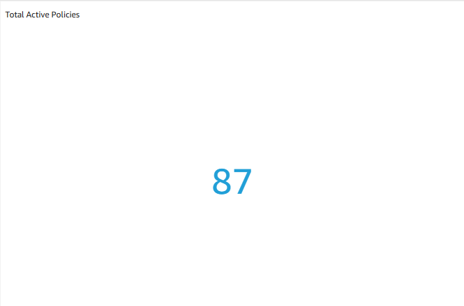
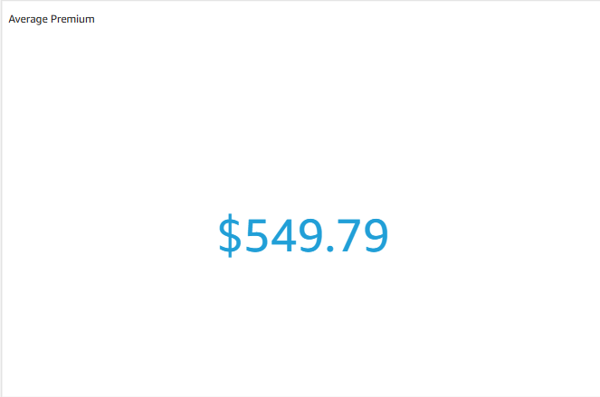
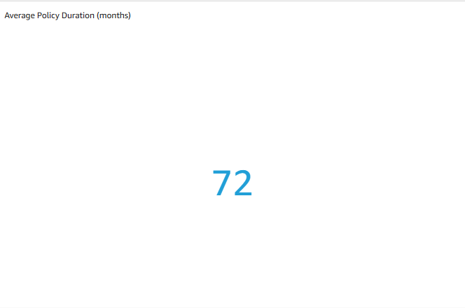
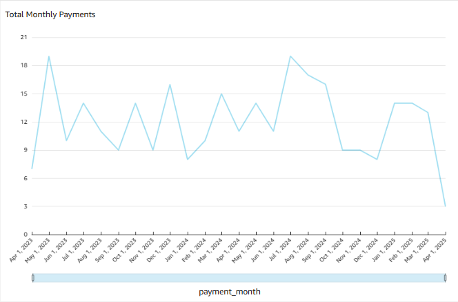
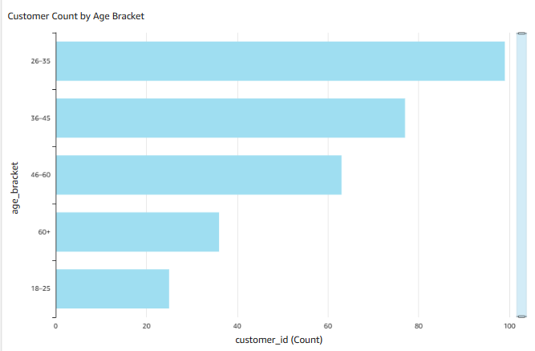
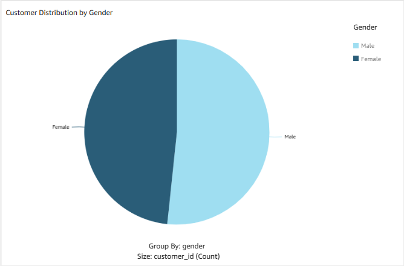
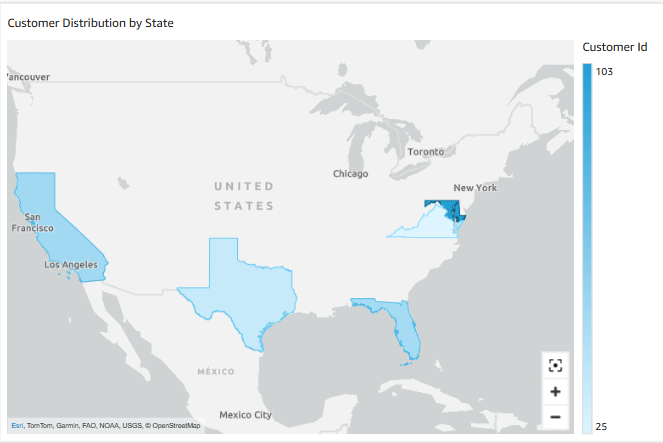

# Dashboard Design

This document outlines the layout, visualization choices, and design decisions behind the BetaLife Life Insurance Policy Dashboard built in AWS QuickSight.

The dashboard was designed as a self-service analytics tool for product managers and leadership at BetaLife to:

- Monitor the performance of their life insurance offerings
- Track trends in customer behavior and policy activity
- Make informed decisions around product strategy, retention, and customer segmentation

It eliminates the need to manually export reports or wrangle spreadsheets.

---

## How the Dashboard is Used

The dashboard is structured into three focused sections, each designed to align with a stakeholder need:

---

### Lapse Trends by Product Type
- Quickly identify which product types have the highest percentage of lapsed or canceled policies
- Use this to prioritize retention strategy by product
- Hover over bars to see both raw count and percentage of lapsed policies

---

### High-Level Portfolio Metrics
- Monitor active policy volume, average premiums, and average policy duration at a glance
- Use the line chart to track monthly premium trends and spot seasonal dips or spikes
- Helpful for executives and product managers needing top-level insights without exports

---

### Customer Demographics
- Understand your customer base by age, gender, and location
- Segment and target marketing campaigns based on demographic breakdowns
- Visualize regional distribution of customers using a filled state map

---

## Layout Overview

The dashboard is organized into the following sections:

### 1. Lapse Trends by Product Type  
**Purpose**: Identify which insurance products contribute most to policy churn.  
**Visual**: Horizontal bar chart showing % of lapsed or canceled policies per product type, with tooltips showing both percentage and raw count.

---

### 2. High-Level Portfolio Metrics  
**Purpose**: Provide at-a-glance KPIs and trends to assess portfolio health.  
**Visuals**:
- KPI: **Total Active Policies**
- KPI: **Average Premium**
- KPI: **Average Policy Duration**
- Line Chart: **Monthly Premium Trends**

---

### 3. Customer Demographics  
**Purpose**: Enable marketing segmentation based on who and where customers are.  
**Visuals**:
- Bar Chart: **Customer Count by Age Bracket**
- Pie Chart: **Customer Distribution by Gender**
- Filled Map: **Customer Count by State**

---

## Sample User Story: View lapse trends by product type

As a Product Manager,  
I want to see how many policies are lapsing by product type,  
So that I can identify which products need retention strategy improvements.

**Acceptance Criteria: Display lapsed policies by product type**

```
Given I am viewing the BetaLife dashboard
When I select the "Policy Status" filter with values 'Lapsed' and 'Canceled'
And I group the data by product type
Then I should see a horizontal bar chart showing the percentage of lapsed policies across product types.  

When I hover over any bar in the chart
Then I should see a tooltip displaying:
- Product Type 
- Count of Lapsed Policies 
- Percentage of Total Lapsed Policies
```


## Sample User Story: View high-level portfolio metrics

As a Product Manager,  
I want to be able to view key peformance metrics,    
So that I can identify trends without relying on manual exports.    

**Acceptance Criteria: Display top-level KPIs and premium trends**

```
Given I am on the BetaLife dashboard
When I load the KPI section
Then I should see the following values:
- Total Active Policies       
- Average Premium             
- Average Policy Duration    
When I scroll to the premium trends section
Then I should be able to view a line chart displaying total monthly premiums
```
  
  
  



## Sample User Story: Explore customer demographics

As a Product Manager,  
I want to be able to analyze our customer base by age, location, and gender,  
So that I can segment marketing efforts.  

**Acceptance Criteria: Display demographic breakdowns**

```
Given I am on the BetaLife dashboard
When I view the demographics section
Then I should see:
- A bar chart grouped by age bracket        
- A pie chart showing gender split          
- A map showing customer count by state     
```
  
  


